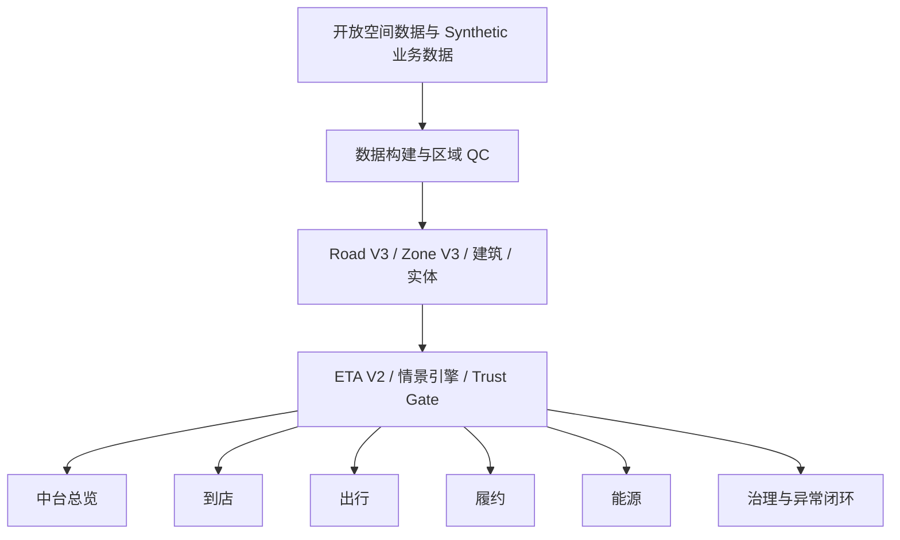

# LBS Master 空间能力中台

面向能源、到店、出行与履约场景的 LBS 产品作品集。项目通过统一的 Road V3、Zone V3、真实建筑、ETA V2 与 Trust Gate，把地图数据转化为可复用、可解释、可执行、可复验的业务解决方案。

> 项目性质：个人产品作品集与本地交互原型，不是生产系统。订单、需求、收入、拥堵指数和大部分情景速度均为 Synthetic 模拟数据，不代表任何公司的真实经营结果。

## 项目定位

项目最初是数个相互独立的业务地图页面。重构后，中台统一管理道路、建筑、功能地块、业务实体、情景、可达性与数据质量，业务模块只消费共享空间能力。

核心原则：

- 中台是主角，能源做深，其他业务做通；
- 一套空间事实支撑多个业务，避免重复建设；
- 数据结论先经过 Trust Gate，再进入业务决策；
- 路网可用性直接约束 ETA 和服务覆盖；
- 住宅区作为真实需求来源参与到店、出行、履约和能源分析；
- 开放事实、算法派生与 Synthetic 经营数据分层披露。

## 产品结构

| 模块 | 主要问题 | 中台能力复用 |
|---|---|---|
| 中台总览 | 区域成熟度、业务接入、能力健康和异常状态 | Road V3、Zone V3、ETA V2、Trust Gate |
| 到店 | 住宅客群看似靠近门店，实际道路 ETA 导致覆盖不足 | 建筑/地块、门店实体、路网可达性 |
| 出行 | 枢纽、跨江和雨天场景下上客等待与供需缺口 | 单行/匝道/桥隧、情景速度、上落客点 |
| 履约 | 几何半径正常，但部分住宅沿路网配送超时 | P90 ETA、服务边界、仓店与住宅需求 |
| 能源 | 存量场站雨天晚高峰覆盖异常 | 完整异常诊断、方案收益、SLA 与复验 |
| 治理 | 判断异常来自数据、算法还是业务策略 | 数据来源、版本、QC、置信度与反馈闭环 |

## 共享能力

### Road V3

统一道路等级、速度、晚高峰/雨天速度、车道、单行、桥隧、可路由性与拓扑 QC。道路不是单纯的视觉图层，而是 ETA、覆盖和空间根因的计算基础。

### Zone V3 与真实建筑

使用道路围合、建筑分布和相关属性形成自然功能地块，替代早期的圆形、椭圆形和大凸包。功能分类包含住宅、商业、办公、产业、公共服务和混合，分类结果属于算法推断，不是官方法定规划边界。

### ETA V2 / 可达性

基于道路图与情景边权计算 5/10/15 分钟可达性、P50/P90 ETA、覆盖变化和关键阻抗路段。当前属于规则沙盘与近似等时圈，不等同于商业导航 ETA。

### Trust Gate

业务结论进入执行前检查坐标一致性、道路连通、速度来源、建筑归属、功能区置信度、实体落点和数据版本。数据不足的区域标记为 `Conditional`，允许探索但不包装为高可信决策结果。

### 异常闭环

统一采用：

```text
问题发现 → Trust Gate → 空间根因 → 建议动作 → 收益估算 → SLA → 复验
```

## 六个上海典型区域

| 区域 | 业务定位 | 当前数据状态 |
|---|---|---|
| 陆家嘴—外滩 | 能源站网覆盖异常深度案例 | 深度业务案例与黄金样例；区域合同仍需统一 |
| 前滩—徐汇滨江 | 跨江多业务综合样板 | Ready；11,732 个真实 OSM 建筑 |
| 徐家汇—漕河泾 | 到店与即时零售 | Conditional；13,453 个真实 OSM 建筑，路网连通待修 |
| 虹桥枢纽 | 枢纽出行和雨天接驳 | Conditional；真实建筑与道路方向属性待补 |
| 张江科学城 | 通勤潮汐与能源补给 | Conditional；真实建筑与道路属性待补 |
| 临港新城 | 长距离履约与能源 | Conditional；真实建筑与道路属性待补 |

当前前滩和徐家汇共展示 25,185 个真实 OSM 建筑轮廓。虹桥、张江和临港的 Synthetic 建筑种子由质量门禁隐藏，仓库不会用虚假建筑填满地图。

## 能源深度案例

场景：陆家嘴—外滩存量充电场站在雨天晚高峰出现 10 分钟覆盖收缩。

| 环节 | Synthetic 演示结果 |
|---|---|
| 异常 | 覆盖单元 253 → 150，下降 41%；可服务需求下降 44% |
| 业务影响 | 估算日服务费影响 -¥3,914 |
| 根因 | 道路降速 55%、跨江瓶颈 32%、末端接入 3%、模型不确定性 10% |
| 动作 | 浦西侧雨天缓解候选点，12 个车位、180kW，并配合分流策略 |
| 复验估算 | 覆盖恢复到 226，恢复 76 个区域/87 个订单，日服务费恢复 +¥3,306 |
| SLA | 4 小时响应、1 天诊断、3 天缓解、7 天复验 |

以上数字用于说明分析框架、方案比较和产品闭环，均非真实经营数据或实际投资结果。

## 技术架构



技术栈：

- 前端：HTML、CSS、原生 JavaScript；
- 地图：Leaflet；
- 底图：高德在线瓦片；
- 空间数据：GeoJSON / JSON；
- 数据构建与发布：Node.js 脚本；
- 测试：Node.js 内置测试框架；
- 运行方式：本地静态服务，默认端口 `4173`。

## 快速启动

### 环境要求

- Node.js 18 或更高版本；
- 建议使用 Chrome 或 Edge；
- 可选：自己的高德开放平台 Key。真实 Key 只能放在被 Git 忽略的本地配置中。

### Windows 一键启动

双击：

```text
start-demo.bat
```

脚本会复制基础数据、接入区域包，并打开：

```text
http://127.0.0.1:4173/
```

### 命令行启动

```powershell
npm run copy:public-data
npm run copy:regional-data
npm run serve
```

不要通过 `file://` 直接双击 `public/index.html`，浏览器会阻止部分本地数据请求。

### 本地高德配置

复制：

```text
public/config.local.example.js
```

为：

```text
public/config.local.js
```

然后只在 `public/config.local.js` 中填写本地 Key。该文件已被 `.gitignore` 排除，不要把真实 Key 写入示例文件或提交历史。

## 测试

```powershell
npm test
```

当前测试覆盖：

- WGS84 → GCJ-02 坐标转换；
- 路径可携带性与绝对路径扫描；
- 六区产品目录；
- 区域数据发布与真实建筑质量门禁。

当前基线为 15 项测试通过。

## 数据构建与发布

| 命令 | 用途 |
|---|---|
| `npm run copy:public-data` | 将基础处理数据复制到 `public/data` |
| `npm run copy:regional-data` | 验证并发布五个区域交付包 |
| `npm run build` | 执行基础地理数据构建流程 |
| `npm run build:roads` | 道路下载结果转换、修复与 QC |
| `npm run verify:synthetic` | 检查 Synthetic 数据规则 |
| `npm run verify:alignment` | 生成道路与底图对齐抽样记录 |
| `npm run serve` | 在 `4173` 端口启动静态服务 |

`public/data/**` 是运行时复制结果，不进入 Git。克隆仓库后必须先运行两个 `copy` 命令，或者直接使用 `start-demo.bat`。

## 仓库结构

```text
LBS-Master/
├─ contracts/                 # 数据与状态合同
├─ data/
│  ├─ processed/              # 可复现的处理结果
│  └─ static/                 # 情景、区域目录与静态配置
├─ docs/                      # PRD、验收、数据口径和设计记录
├─ experiments/               # 陆家嘴 Road/Zone/ETA 试验资产
├─ public/                    # 主应用与本地 Leaflet 资源
├─ regional-data-delivery/    # 五个区域的处理后数据、QC 与构建脚本
├─ scripts/                   # 基础数据构建、复制和静态服务脚本
├─ tests/                     # 自动化检查
├─ start-demo.bat             # Windows 一键启动
└─ package.json
```

## 数据来源与许可

- 道路与部分建筑：OpenStreetMap，署名 **© OpenStreetMap contributors**，相关数据库遵循 ODbL；
- 底图：高德地图；Key 由使用者自行申请并保存在本地；
- Leaflet：仓库中的本地依赖遵循其 BSD-2-Clause 许可证；
- 功能地块：本项目算法派生，仅用于分析与演示，不是官方规划红线；
- 业务实体、需求、订单、收入、路况与大部分速度：Synthetic。

详细说明见 [`docs/data-attribution.md`](docs/data-attribution.md)。

## GitHub 体积策略

仓库保留源码、处理后数据、区域 QC 与可复现脚本，同时排除：

- `.env`、`public/config.local.js` 等本地密钥；
- `node_modules`、`.venv`、Python/测试缓存；
- 原始 OSM/Overpass 下载；
- `public/data` 运行时复制结果；
- 超过 50 MB、能够通过脚本重新生成的热力数据；
- 实验预览重复数据与本地 Agent 交接包。

## 当前限制与后续路线

- 六区数据成熟度尚不一致；
- 虹桥、张江、临港需要补充真实建筑和道路方向/桥隧属性；
- 陆家嘴黄金样例尚需转换为统一区域合同；
- 时间、天气和节点情景在部分区域的状态传播仍需统一；
- ETA 和收益均为演示级模拟，没有实时交通、生产订单或线上 A/B 实验；
- 当前为本地静态原型，尚未部署为线上服务。

推荐路线：陆家嘴合同化 → 前滩/徐家汇标准化 → 虹桥/张江/临港补全 → 统一情景引擎 → 统一异常中心与作品集演示。

## 面试讲述重点

> 我最初做的是多个业务地图页面，但发现它们只有视觉共性，没有真正复用。于是我把项目重构为 LBS 空间能力中台，用统一 Road V3、Zone V3、建筑、ETA 和 Trust Gate 支撑多个业务。能源场景用存量站覆盖异常展示完整闭环，其他业务复用相同能力。项目重点不是“画地图”，而是把空间数据、数据质量、业务影响、策略动作、SLA 和复验连接起来。

更完整的产品定义见 [`docs/PRD-LBS-MIDDLE-PLATFORM-2026-08-30.md`](docs/PRD-LBS-MIDDLE-PLATFORM-2026-08-30.md)。

## 许可证说明

本仓库目前没有为自研代码授予统一的开源许可证。公开可见不等于自动获得复制、修改或再分发许可；第三方数据与依赖分别遵循其原始许可证。若后续需要正式开源，应先确定代码许可证，并单独核对 ODbL 数据库再分发义务。
